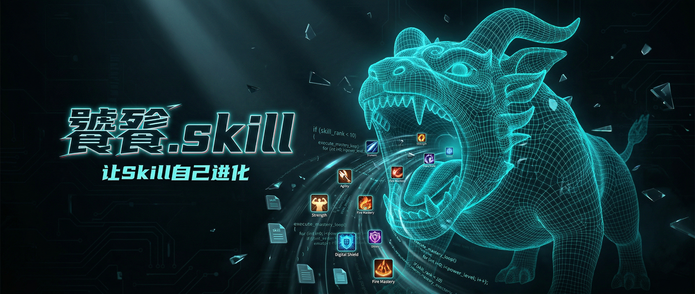

<div align="center">

# 饕餮.skill

> *"不是简单的代码合并工具，而是一个有学习能力的技能进化引擎。理解背后的'为什么'比复制'是什么'重要一百倍。"*

[](LICENSE)
[](https://claude.ai/code)
[](https://agentskills.io)

<br>



<br>

你的 Skill 写得不够好，但不知道差在哪？<br>
你看到一个优秀的 Skill，想吸收它的精华？<br>
你想让两个 Skill 对比 PK，用数据说话？<br>
你希望每次进化的经验都能被记住，越用越准？<br>

**把优秀的 Skill 喂给饕餮，让你的 Skill 自己进化。**

<br>

提供两个 Skill（目标 A + 参考源 B），饕餮会自动并行测试、反向工程分析、<br>
提炼可复用模式，然后渐进式注入改进——每一步都让你确认。

[核心流程](#核心流程) · [安装](#安装) · [使用](#使用) · [效果示例](#效果示例) · [模式库](#模式库) · [详细安装说明](INSTALL.md)

</div>

---

Created by [@binggandata](https://github.com/binggandata) · [小红书](https://xhslink.com/m/4ndptyfq4vu) · [X / Twitter](https://x.com/bggg_ai) · 微信：binggandata2

## 核心能力

| 能力 | 说明 |
|------|------|
| **并行对标** | 同时用两个 Skill 跑相同任务，记录全过程（思维链、工具调用、耗时） |
| **反向工程** | 不只是"B 更好"，而是深入分析**为什么更好**，提炼背后的设计哲学 |
| **渐进注入** | 一次只改一个维度，沙盒测试通过 + 用户确认后才正式写入 |
| **模式记忆** | 每次成功的进化都存入模式库，下次直接推荐，越用越准 |

---

## 核心流程

```
用户："把 B 喂给 A"
        ↓
Phase 1  解析吸收 → 读取两个 Skill，生成能力地图
        ↓
Phase 2  并行对标 → 自动生成测试任务，双 Agent 同时执行 + 全程追踪
        ↓
Phase 3  反向工程 → 六维深度分析（速度/准确度/鲁棒性/输出质量/Prompt策略/工具使用）
        ↓
Phase 4  渐进注入 → 按优先级逐个应用模式，沙盒测试 + 用户确认
        ↓
Phase 5  学习记忆 → 将成功模式存入模式库，积累经验
```

---

## 安装

### Claude Code

> **重要**：Claude Code 从 **git 仓库根目录** 的 `.claude/skills/` 查找 skill。请在正确的位置执行。

```bash
# 安装到当前项目（在 git 仓库根目录执行）
mkdir -p .claude/skills
git clone https://github.com/binggandata/bggg-skill-taotie .claude/skills/bggg-skill-taotie

# 或安装到全局（所有项目都能用）
git clone https://github.com/binggandata/bggg-skill-taotie ~/.claude/skills/bggg-skill-taotie
```

### OpenClaw

```bash
git clone https://github.com/binggandata/bggg-skill-taotie ~/.openclaw/workspace/skills/bggg-skill-taotie
```

> 详细说明见 [INSTALL.md](INSTALL.md)

---

## 使用

在 Claude Code 中直接说：

```
把 last30days 喂给 bggg-creator-research，让它的数据抓取能力升级
```

或者用更简洁的方式：

```
用 skill-B 优化 skill-A
```

```
对比一下这两个 skill，我只想知道 B 好在哪
```

```
skill 进化 / skill 升级 / 合并 skill
```

饕餮会自动识别你的意图并执行对应流程。

---

## 效果示例

> 输入：`把 last30days 喂给 bggg-creator-research`

```
饕餮 ❯ 已读取两个 Skill，生成能力地图：

  能力维度          | A (creator-research) | B (last30days)
  ─────────────────┼──────────────────────┼──────────────
  数据抓取速度       | ★★☆☆☆ 串行          | ★★★★★ 并发
  错误处理          | ★★☆☆☆ 直接报错       | ★★★★☆ 降级重试
  输出格式          | ★★★☆☆ 自由文本       | ★★★★★ JSON Schema

饕餮 ❯ 准备用 3 个测试任务对比，确认吗？

用户  ❯ 可以

饕餮 ❯ 并行执行完成。发现 3 个优势模式：
  1. 并发抓取优化  — 预计提升 60% 速度（推荐先试这个）
  2. 错误降级方案  — 遇到 404 不再崩溃
  3. 输出 Schema 约束 — 强制结构化输出

  要我先应用"并发抓取"吗？

用户  ❯ 先试第一个

饕餮 ❯ 已在沙盒测试通过（速度 +58%，准确率持平）
  正式写入 bggg-creator-research ✅
  模式已存入经验库，下次类似场景直接推荐。
```

---

## 特殊场景

| 场景 | 饕餮的做法 |
|------|-----------|
| 用户没指明优化方向 | 完整走 Phase 1-5，让测试数据说话 |
| 用户指明了方向 | 跳过全面测试，聚焦指定维度 |
| 只想对比不想改 | 只做到 Phase 3 输出报告 |
| 反馈历史进化效果 | 更新模式库权重，优化未来建议 |

---

## 模式库

饕餮的"记忆"。每次成功进化提炼出的可复用模式自动存入 `references/pattern-library.json`。

### 模式分类

| 类别 | 典型模式 |
|------|---------|
| **性能优化** | 并发、缓存、Prompt 精简 |
| **质量提升** | 输出约束、Schema 校验、二次验证 |
| **鲁棒性** | 错误处理、降级方案、重试机制 |
| **Prompt 策略** | CoT、Few-shot、角色设定、分步指引 |
| **架构优化** | 模块拆分、渐进式披露、工具复用 |

### 模式生命周期

`发现 → 提炼 → 验证 → 入库 → 累积 → 淘汰`

模式的 `success_count` 和 `user_satisfaction` 会随使用更新，让饕餮的建议越来越精准。

---

## 分析维度

饕餮从以下六个维度做反向工程分析：

| 维度 | 要回答的问题 | 提取目标 |
|------|-------------|---------|
| **速度** | B 为什么更快？ | 并行策略？缓存？更简洁的 Prompt？ |
| **准确度** | B 的输出为什么更准？ | Few-shot 示例？二次验证？Schema 约束？ |
| **鲁棒性** | B 遇到错误怎么处理？ | 重试机制？降级方案？异常捕获？ |
| **输出质量** | B 的格式为什么更好？ | 模板设计？后处理步骤？约束指令？ |
| **Prompt 策略** | B 的指令有什么高明之处？ | CoT？分步指引？角色设定？ |
| **工具使用** | B 调用了什么不同的工具？ | 更好的 API？脚本自动化？ |

---

## 安全守则

- 读取外部 Skill 时检查可疑指令（prompt injection、恶意代码）
- 不自动执行不认识的脚本——先展示内容让用户确认
- 修改目标 Skill 前必须创建备份快照
- 发现安全隐患时立即告知用户

---

## 项目结构

本项目遵循 [AgentSkills](https://agentskills.io) 开放标准，整个 repo 就是一个 skill 目录：

```
bggg-skill-taotie/
├── SKILL.md                   # skill 入口（官方 frontmatter）
├── README.md                  # 项目说明
├── INSTALL.md                 # 详细安装指南
├── LICENSE                    # MIT License
├── banner.png                 # 头图
├── references/                # 参考文档
│   ├── analysis-guide.md      # 分析指南（六维框架）
│   ├── patterns.md            # 模式库文档
│   └── pattern-library.json   # 模式库数据（随使用积累）
└── evals/                     # 测试用例
    └── evals.json
```

---

## 注意事项

- **Skill 质量决定进化空间**：参考源 B 越优秀，提炼出的模式越有价值
- 建议优先选择：与目标 A **功能重叠**的优秀 Skill 作为参考源
- 每次进化只改 1-2 个维度，避免过度修改导致功能退化
- 饕餮会自动备份目标 Skill，改坏了可以回滚

---

<div align="center">

MIT License © [binggandata](https://github.com/binggandata)

[小红书](https://xhslink.com/m/4ndptyfq4vu) · [X / Twitter](https://x.com/bggg_ai) · 微信：binggandata2

</div>
